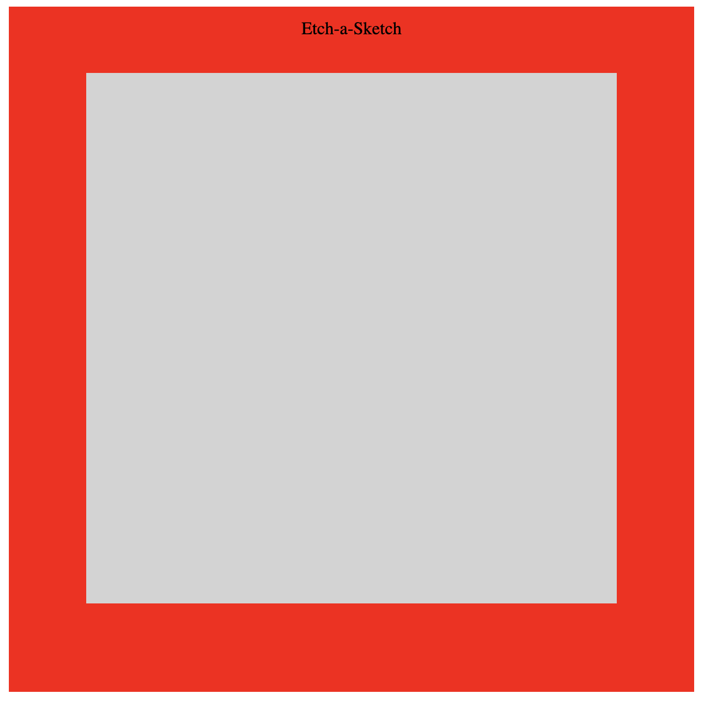

Etch-a-Sketch project from The Odin Project curriculum: https://www.theodinproject.com/courses/web-development-101/lessons/etch-a-sketch-project

Live: https://morrisrob.github.io/etch-a-sketch/index.html

Javascript Etch-a-Sketch app with reset functionality.  

